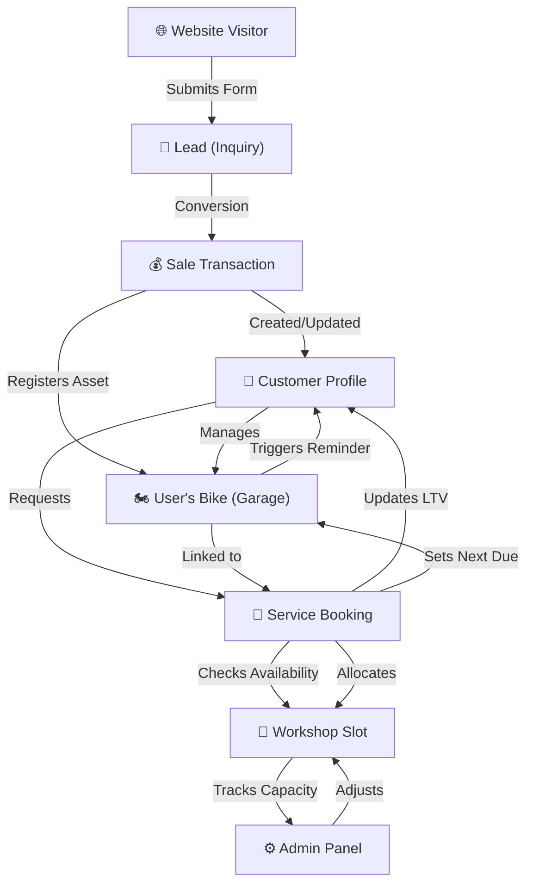

# Dealership Ecosystem Data Flow

This diagram illustrates the lifecycle of a customer interaction within the dealership ecosystem, from initial lead to recurring service maintenance and workshop management.

## Data Entity Relationships

| Entity | Primary Key | Key Relationships |
| :--- | :--- | :--- |
| **Lead** | `_id` | `interests` (Bike Models) |
| **Customer** | `_id` | `googleId` (Auth), `lifetimeValue` |
| **UserBike** | `_id` | `userId` (Customer), `bikeId` (Bike Model) |
| **Sale** | `_id` | `customerId`, `bikeId` |
| **Service** | `_id` | `customerId`, `regNumber` (UserBike), `appointmentDate/Time` (WorkshopSlot) |
| **WorkshopSlot** | `_id` | `date`, `slotTime` (Composite Unique Key) |

## Workshop Management Process

1. **Capacity Definition**: Admin sets standard slots (e.g., 9:00 AM, 11:00 AM) with a max capacity (e.g., 5 bikes per slot).
2. **Booking**: When a service is booked, the system checks if the `bookedCount` for that `date + slotTime` is less than `capacity`.
3. **Allocation**: On successful booking, `bookedCount` increments.
4. **Maintenance**: If a service is cancelled or rescheduled, the slot counts are adjusted accordingly.
